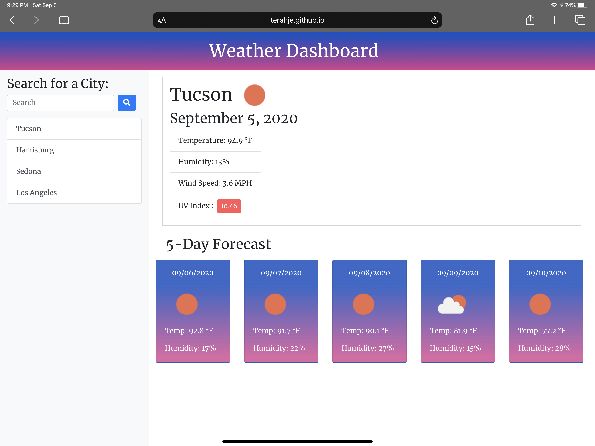

# Weather Dashboard

**Description:  This site provides the current weather and a 5 day forcast when you search with a city's name.** 

This app uses the OpenWeahter API to retrieve data for cities entered by the user and updates the weather for the selected city. The previously searched cities will display under the search bar so you are able to easily reuse previous searches.

Technologies Used: HTML, CSS, JavaScript, jQuery, Bootstrap

## Credits
- Open Weather Map - https://openweathermap.org/api

https://terahje.github.io/week-6-challenge/

